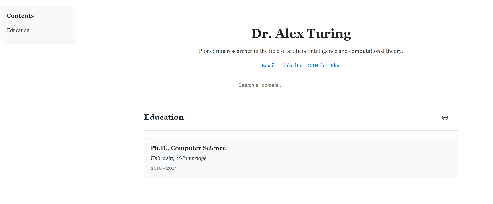
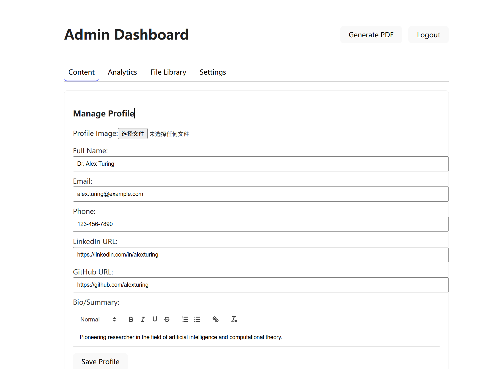

[English](./README.en.md)

# 个人学术作品集平台

本项目提供一个简洁、高效的平台，用于管理和展示个人学术成果与作品。

---

## ✨ 功能预览

### 公开展示页面



### 管理员后台



---

## 🚀 快速上手

请按照以下说明在您的本地计算机上运行本项目。

### 1. 先决条件

您的系统上必须安装 **Node.js**（推荐 v18 或更高版本）。它自带 `npm`（Node 包管理器）。

- 如需安装，请访问 [https://nodejs.org/](https://nodejs.org/)。
- 在终端中运行 `node -v` 和 `npm -v` 进行验证。

### 2. 安装与设置

1.  **克隆本仓库**。
2.  **导航到项目根目录**: `cd path/to/your/project`
3.  **创建并配置您的环境文件**:
    - 进入 `backend` 文件夹。
    - 复制 `.env.example` 文件，并将副本重命名为 `.env`。
    - 打开新的 `.env` 文件，设置您想要的 `ADMIN_PASSWORD` 和 `JWT_SECRET`。
4.  **安装所有依赖项**: 在**项目根目录**下运行：
    ```bash
    npm run install:all
    ```
    此命令会为根目录、后端和前端安装依赖项。

### 3. 运行应用程序

1.  确保您位于**项目根目录**下。
2.  使用单个命令启动两个服务器：
    ```bash
    npm run dev
    ```
    该命令使用 `concurrently` 同时启动后端 API 和前端 Vite 服务器。

### 4. 访问应用程序

- **公开作品集**: `http://localhost:5173`
- **博客**: `http://localhost:5173/blog`
- **管理员登录**: `http://localhost:5173/login`

---
### 5. 清理环境 (可选)

要重置项目（删除所有依赖项和数据库），请在**项目根目录**下运行此命令：
```bash
npm run clean
```

---

## 📄 许可证

本项目根据 MIT 许可证授权。

Copyright (c) 2025 yuhong
